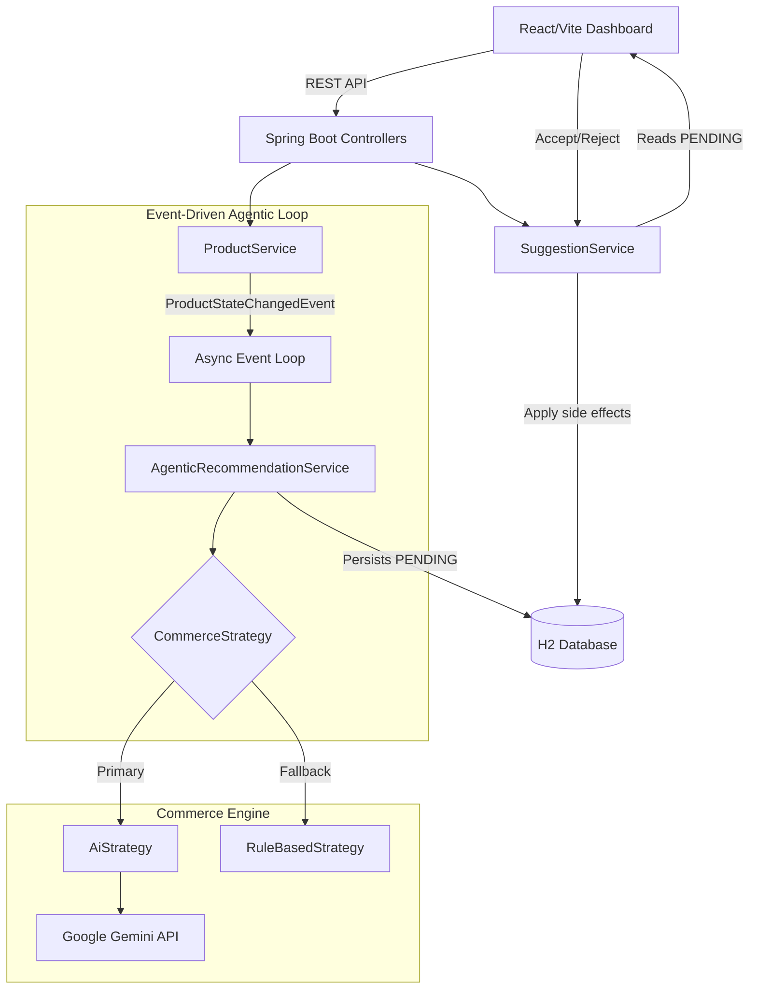

# StockPulse

AI-powered inventory and dynamic pricing operations for e-commerce merchandising teams.

StockPulse continually monitors inventory and demand signals, asynchronously reasons about product health using Google Gemini AI, and generates high-confidence pricing and replenishment recommendations for human merchandising teams to review and apply.

## Problem

E-commerce merchandising teams often struggle to react quickly to fluctuating inventory levels and sudden demand spikes. Manual monitoring does not scale across large catalogs, leading to missed opportunities: low inventory risks stockouts, while unexpected demand surges require rapid pricing or replenishment decisions. 

StockPulse solves this by shifting from manual reporting to an event-driven, agentic AI architecture. It observes signals in real-time, determines the best course of action using large language models, and queues these decisions with full explainability for a human operator to approve.

## What StockPulse Does

StockPulse operates on a clear agentic lifecycle:

1. **OBSERVE**: Listens for state changes (e.g., product sales, inventory updates).
2. **DETECT**: Identifies critical conditions like `INVENTORY_LOW` or `DEMAND_SPIKE`.
3. **REASON**: Asynchronously analyzes the product state using Google Gemini AI (or a deterministic rule engine fallback).
4. **RECOMMEND**: Formulates an actionable pricing or reorder suggestion, including a confidence score and plain-text reasoning.
5. **HUMAN REVIEW**: Surfaces the pending recommendations in a professional dashboard.
6. **ACT**: Applies the change atomically only if the human operator explicitly accepts the suggestion.

AI recommendations are **never** automatically applied to live products. The human operator is always the final checkpoint.

## System Architecture



**Architecture Overview**:
The frontend is a lightweight React/Vite dashboard that polls the backend for pending suggestions. The backend is a robust Java/Spring Boot application. State changes (like simulating a sale) trigger internal Spring application events. These events are processed asynchronously by the `AgenticRecommendationService`, which delegates complex reasoning to the `CommerceStrategy`. Suggestions are saved to the database as `PENDING`. When the UI sends a `PATCH` to accept a suggestion, the `SuggestionService` applies the side effects (updating product price or stock).

## Technology Stack

| Layer | Technology | Purpose |
|------|------------|---------|
| **Frontend** | React + Vite | Merchandising dashboard |
| **Backend** | Java + Spring Boot | REST API and application logic |
| **Persistence** | Spring Data JPA + H2 | Product and suggestion state |
| **AI** | Google Gemini API | AI recommendations and reasoning |
| **Async** | Spring `@Async` / Events | Event-driven recommendation loop |
| **Build** | Maven | Backend dependency and build management |
| **Frontend Build** | npm / Vite | Frontend asset bundling |
| **Testing** | JUnit 5 + Mockito | Backend unit testing |

## Core Domain Model

- `Product`: Represents an e-commerce item with fields for `currentPrice`, `stockLevel`, `reorderThreshold`, and `demandVelocity`.
- `PricingSuggestion`: Represents an actionable recommendation to change a product's price (`recommendedValue`, `direction`, `confidence`).
- `ReorderSuggestion`: Represents an actionable recommendation to procure more inventory.

**Key Enums**:
- `SuggestionStatus`: `PENDING`, `ACCEPTED`, `REJECTED`
- `TriggerReason`: `INVENTORY_LOW`, `DEMAND_SPIKE`
- `PricingDirection`: `INCREASE`, `DECREASE`, `HOLD`

## Agentic Loop

The system operates using an asynchronous event-driven loop to prevent blocking REST threads with long-running AI operations. 

1. An order is processed, updating product stock or demand.
2. `ProductService` publishes a `ProductStateChangedEvent`.
3. The asynchronous listener evaluates if `INVENTORY_LOW` (stock < threshold) or `DEMAND_SPIKE` applies.
4. Idempotency checks prevent duplicate `PENDING` suggestions for the same product and trigger.
5. The configured `CommerceStrategy` is invoked.
6. The AI evaluates the product context and generates structured JSON recommendations.
7. Suggestions are saved to the repository as `PENDING`.
8. The dashboard displays the decision queue.
9. A human operator accepts or rejects the queued actions.

## Commerce Engine

The backend utilizes a pluggable strategy pattern (`CommerceStrategy`) to determine pricing and reorder logic. 

```text
CommerceStrategy
├── RuleBasedStrategy (Fallback)
└── AiStrategy (Primary)
```

**Rule-Based Fallback Rules**:
- **Inventory Low**: Suggests a +10% price increase (to slow velocity) and reorders using the formula `max((reorderThreshold * 3) - currentStock, 1)`, ensuring a minimum reorder quantity of 1.
- **Demand Spike**: Suggests a +5% price increase.
- **Normal**: Suggests `HOLD` with no changes.

The engine defaults to `AiStrategy` if configured via the `COMMERCE_STRATEGY` environment variable, falling back safely to deterministic rules if the AI fails.

## AI / Gemini Integration

StockPulse integrates with the **Google Gemini API** (`gemini-3.6-flash`) to perform complex reasoning. 
- The AI receives precise product telemetry (current price, stock, thresholds, demand velocity).
- Specific prompts are injected based on whether the trigger was `INVENTORY_LOW` or `DEMAND_SPIKE`.
- The AI generates a structured JSON response containing the recommended value, direction, confidence score, and plain-text reasoning.
- Responses are strictly validated. Malformed JSON, unsafe values (negative pricing/stock), or timeouts are caught gracefully, and the system seamlessly falls back to the `RuleBasedStrategy`.

*Note: The Gemini API key must be supplied via the `GEMINI_API_KEY` environment variable and is never committed to the repository.*

## Human-in-the-Loop

StockPulse treats human approval as a primary feature, not an implementation detail. 

```text
PENDING
   |
   +--> ACCEPTED
   |      |
   |      +--> Pricing updates live product price
   |      +--> Reorder increases simulated stock
   |
   +--> REJECTED
          |
          +--> Suggestion is archived; no business side effect
```
AI recommends; the merchandiser decides.

## Dashboard

The React frontend serves as the merchandising operations center. The dashboard features:
- **Operations Activity Feed**: A real-time timeline tracking user interactions and agentic background events.
- **Inventory Table**: Visual `ASCII` stock bars, demand velocity metrics, and a "Simulate Sale" trigger.
- **Decision Queue**: Pending recommendation cards displaying the AI's confidence, exact reasoning, proposed changes, and Accept/Reject workflow controls.

## API Overview

| Method | Endpoint | Purpose |
|--------|----------|---------|
| `POST` | `/api/products` | Create a new product |
| `GET` | `/api/products` | Retrieve all inventory products |
| `PATCH` | `/api/products/{id}/stock` | Manually update product stock |
| `POST` | `/api/products/{id}/orders` | Simulate a sale, triggering the agentic loop |
| `POST` | `/api/products/{id}/suggest-pricing` | Manually trigger AI pricing suggestion |
| `POST` | `/api/products/{id}/suggest-reorder` | Manually trigger AI reorder suggestion |
| `GET` | `/api/suggestions` | Retrieve pending recommendations (`?status=PENDING`) |
| `PATCH` | `/api/pricing-suggestions/{id}` | Accept/Reject a pricing suggestion |
| `PATCH` | `/api/reorder-suggestions/{id}` | Accept/Reject a reorder suggestion |

## Demo Flow

To demonstrate StockPulse to a judge, follow this 5-minute sequence:
1. **Open Dashboard**: Navigate to `http://localhost:5173/`. Point out the professional UI and active monitoring state.
2. **Simulate a Sale**: Click "Simulate Sale" on *Cotton T-Shirt*. The API returns immediately.
3. **Agentic Processing**: Explain that the event loop caught the inventory drop in the background and is consulting Gemini AI.
4. **Decision Queue**: After a few seconds, observe the new `INVENTORY_LOW` recommendation cards populate the sidebar.
5. **AI Reasoning**: Highlight the AI's reasoning text and confidence score explaining *why* it recommends a price increase to slow sales.
6. **Accept Action**: Click **ACCEPT** on the pricing suggestion.
7. **Verify Side Effects**: Show the table update live, reflecting the newly applied product price. The Activity Feed logs the exact decision.

## Quick Start

Ensure you have Java 21+ and Node.js installed.

### Backend

Set your Gemini API key in your terminal session. **Do not commit this key.**

```powershell
# Set API key (Windows)
$env:GEMINI_API_KEY="your-api-key-here"
$env:COMMERCE_STRATEGY="aiStrategy"

# Run Spring Boot backend (from /backend directory)
./mvnw.cmd spring-boot:run "-Dspring-boot.run.profiles=secret"
```
The backend will run on `http://localhost:8080`.

### Frontend

```powershell
# Install dependencies (from /frontend directory)
npm install

# Start Vite dev server
npm run dev
```
The frontend will run on `http://localhost:5173`.

## Project Structure

```text
/
├── backend/
│   ├── src/main/java/com/stockpulse/
│   │   ├── controller/          # REST endpoints
│   │   ├── domain/              # JPA Entities (Product, Suggestions)
│   │   ├── dto/                 # Data transfer objects
│   │   ├── event/               # Spring application events & listeners
│   │   ├── repository/          # Spring Data JPA repositories
│   │   └── service/
│   │       ├── ai/              # LLM Gateway and JSON parsing
│   │       └── strategy/        # RuleBased and Ai Strategy implementations
│   └── pom.xml
├── frontend/
│   ├── src/
│   │   ├── components/          # Dashboard, Cards, Activity Feed
│   │   ├── App.jsx              # Main UI logic & polling
│   │   └── index.css            # Enterprise charcoal styling
│   └── package.json
└── README.md
```

## Resilience & Safety

StockPulse is engineered for reliability in the face of external system failures:
- **Fallback Mechanisms**: If the Gemini API times out, returns 500, or provides malformed non-JSON data, the system automatically falls back to deterministic rules.
- **Validation Constraints**: AI outputs are strictly validated. Negative prices or stock recommendations are rejected during parsing.
- **Idempotency**: The agentic loop ignores duplicate triggers if a `PENDING` suggestion already exists for the same product, trigger reason, and suggestion type.
- **Human Approval**: Absolutely no state mutations occur until a human operator confirms the recommendation.

## Architectural Decisions

- **Strategy Pattern**: The `CommerceStrategy` interface isolates complex AI integration from standard business logic, making it easy to swap or test reasoning engines.
- **Asynchronous Loop**: Standard Spring `@Async` and Application Events decoupled the REST request thread from the Gemini API call latency.
- **H2 In-Memory DB**: Chosen to optimize for local hackathon velocity without requiring Docker or persistent infrastructure setup.
- **React/Vite Frontend**: Selected for rapid UI iteration and high-performance client-side rendering.

## Testing

The system currently has **21** passing automated tests covering the backend logic:
- `SuggestionServiceTest`: Validates the human checkpoint side effects (acceptance/rejection state transitions).
- `AgenticEventLoopTest`: Verifies the asynchronous event broadcasting and idempotency protections.
- `AiStrategyTest`: Mocks the LLM Gateway to test parsing, mapping, and fallback behavior.
- `RuleBasedStrategyTest`: Validates the deterministic math of the fallback rules.

## Scope / Out of Scope

StockPulse focuses strictly on operations. The following are intentionally out of scope for this hackathon:
- E-commerce storefront rendering
- Shopping carts and checkout flows
- Payment gateways
- Integration with external supplier APIs
- Real-world competitor price scraping

## Why This Approach

This architecture demonstrates immediate business value with a clear, decoupled technical design. By keeping the AI strictly within an asynchronous reasoning loop and requiring a human checkpoint, we showcase the power of Large Language Models to assist operations teams without taking dangerous autonomous actions. The pluggable strategy pattern guarantees system resilience even if the AI layer fails.
